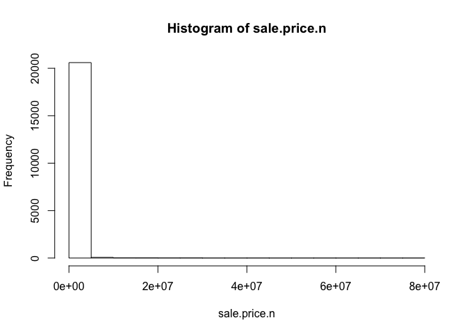
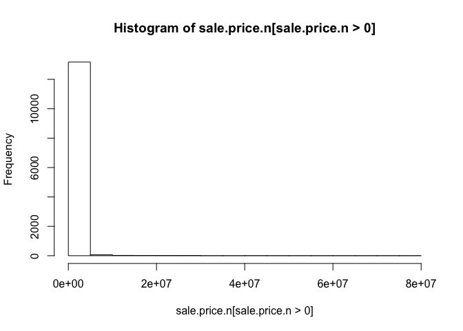
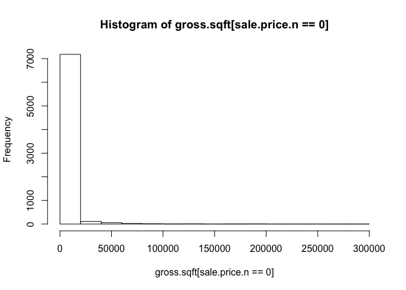
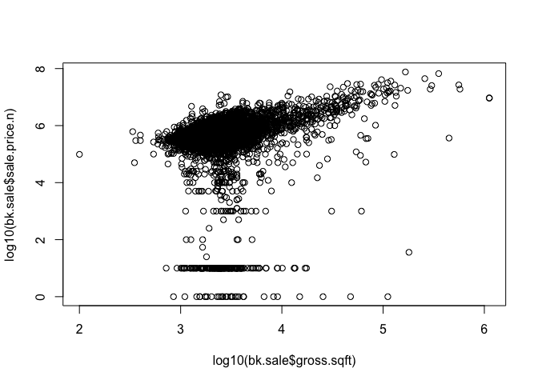
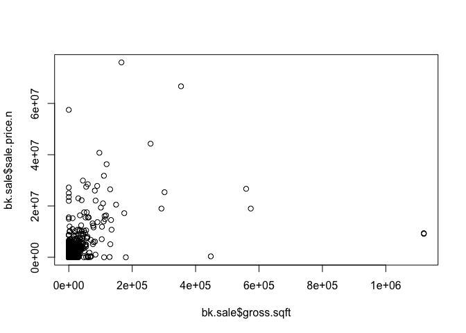
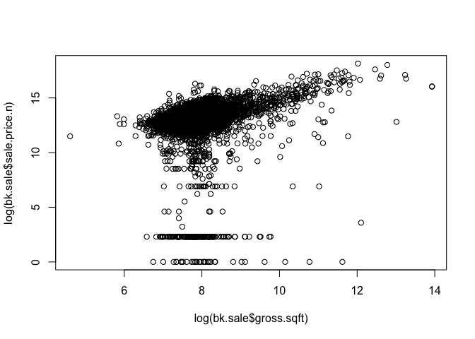
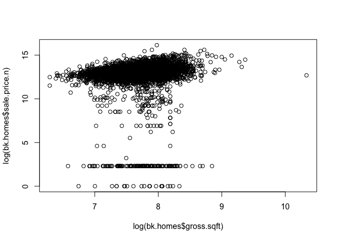
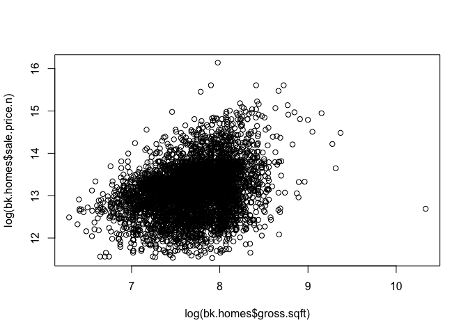

R# Analysis
Bill Kerneckel, Kyle Killion, Eyal Greenberg  
May 28, 2016  

<br>

## Analysis for 2011 Brooklyn real estate data


#### Step 1 - Analysis the sales and square footage data. We need to make sure sales price is correct.
`````````````
attach(bk)
hist(sale.price.n) # Something weird here
hist(sale.price.n[sale.price.n>0])
hist(gross.sqft[sale.price.n==0])
detach(bk)
`````````````


```r
knitr::opts_chunk$set(cache=TRUE)

attach(bk)
hist(sale.price.n)
```

<!-- -->

```r
hist(sale.price.n[sale.price.n>0])
```

<!-- -->

```r
hist(gross.sqft[sale.price.n==0])
```

<!-- -->

```r
detach(bk)
```

<br>

#### Step 2 - From the analysis above we need to only keep the actual sales data
`````````````
bk.sale <- bk[bk$sale.price.n!=0,]
plot(bk.sale$gross.sqft,bk.sale$sale.price.n)
plot(log10(bk.sale$gross.sqft),log10(bk.sale$sale.price.n))
`````````````
<br>


```r
knitr::opts_chunk$set(cache=TRUE)

bk.sale <- bk[bk$sale.price.n!=0,]
plot(bk.sale$gross.sqft,bk.sale$sale.price.n)
```

<!-- -->

```r
plot(log10(bk.sale$gross.sqft),log10(bk.sale$sale.price.n))
```

<!-- -->

<br>

#### Step 3 - Keep only the actual sales 
`````````````
bk.sale <- bk[bk$sale.price.n!=0,]
plot(bk.sale$gross.sqft,bk.sale$sale.price.n)
plot(log(bk.sale$gross.sqft),log(bk.sale$sale.price.n))
`````````````
<br>


```r
bk.sale <- bk[bk$sale.price.n!=0,]
plot(bk.sale$gross.sqft,bk.sale$sale.price.n)
```

<!-- -->

```r
plot(log(bk.sale$gross.sqft),log(bk.sale$sale.price.n))
```

<!-- -->


#### Step 4 - For now, let's look at 1-, 2-, and 3-family homes
`````````````
bk.homes <- bk.sale[which(grepl("FAMILY",bk.sale$building.class.category)),]
dim(bk.homes)
plot(log(bk.homes$gross.sqft),log(bk.homes$sale.price.n))
summary(bk.homes[which(bk.homes$sale.price.n<100000),])
`````````````
<br>


```r
knitr::opts_chunk$set(cache=TRUE)

bk.homes <- bk.sale[which(grepl("FAMILY",bk.sale$building.class.category)),]
dim(bk.homes)
```

```
## [1] 5403   24
```

```r
plot(log(bk.homes$gross.sqft),log(bk.homes$sale.price.n))
```

<!-- -->

```r
summary(bk.homes[which(bk.homes$sale.price.n<100000),])
```

```
##     borough                     neighborhood
##  Min.   :3   EAST NEW YORK            : 47  
##  1st Qu.:3   BEDFORD STUYVESANT       : 33  
##  Median :3   BOROUGH PARK             : 23  
##  Mean   :3   OCEAN HILL               : 23  
##  3rd Qu.:3   FLATBUSH-EAST            : 21  
##  Max.   :3   BUSHWICK                 : 16  
##              (Other)                  :176  
##                                  building.class.category
##  02  TWO FAMILY HOMES                        :196       
##  01  ONE FAMILY HOMES                        : 74       
##  03  THREE FAMILY HOMES                      : 69       
##  04  TAX CLASS 1 CONDOS                      :  0       
##  05  TAX CLASS 1 VACANT LAND                 :  0       
##  06  TAX CLASS 1 - OTHER                     :  0       
##  (Other)                                     :  0       
##  tax.class.at.present     block           lot        ease.ment     
##  1      :339          Min.   : 450   Min.   :  1.0   Mode:logical  
##         :  0          1st Qu.:1948   1st Qu.: 21.5   NA's:339      
##  1A     :  0          Median :4101   Median : 37.0                 
##  1B     :  0          Mean   :4346   Mean   : 48.6                 
##  1C     :  0          3rd Qu.:6192   3rd Qu.: 57.0                 
##  2      :  0          Max.   :8932   Max.   :616.0                 
##  (Other):  0                                                       
##  building.class.at.present                                      address   
##  C0     :68                563 DECATUR ST                           : 10  
##  B1     :57                1153 54TH   STREET                       :  7  
##  B3     :47                103 DOSCHER STREET                       :  3  
##  B2     :45                392 PUTNAM AVENUE                        :  3  
##  B9     :28                701 AVENUE K                             :  3  
##  A1     :19                109 CLIFTON PL                           :  2  
##  (Other):75                (Other)                                  :311  
##      apartment.number    zip.code     residential.units commercial.units 
##              :336     Min.   :11203   Min.   :1.000     Min.   :0.00000  
##  3           :  1     1st Qu.:11208   1st Qu.:2.000     1st Qu.:0.00000  
##  4           :  1     Median :11218   Median :2.000     Median :0.00000  
##  5           :  1     Mean   :11219   Mean   :1.979     Mean   :0.06785  
##  0A          :  0     3rd Qu.:11230   3rd Qu.:2.000     3rd Qu.:0.00000  
##  1           :  0     Max.   :11238   Max.   :3.000     Max.   :1.00000  
##  (Other)     :  0                                                        
##   total.units    land.square.feet gross.square.feet   year.built  
##  Min.   :1.000   2,000  : 76      3,600  : 15       Min.   :1899  
##  1st Qu.:2.000   2,500  : 21      2,472  :  8       1st Qu.:1903  
##  Median :2.000   2,003  : 16      2,520  :  7       Median :1920  
##  Mean   :2.047   1,800  : 11      2,160  :  5       Mean   :1924  
##  3rd Qu.:3.000   1,600  : 10      2,400  :  5       3rd Qu.:1930  
##  Max.   :3.000   4,000  : 10      1,440  :  4       Max.   :2007  
##                  (Other):195      (Other):295                     
##  tax.class.at.time.of.sale building.class.at.time.of.sale   sale.price 
##  Min.   :1                 C0     :69                     $10    :143  
##  1st Qu.:1                 B1     :57                     $1     : 21  
##  Median :1                 B3     :47                     $10,000: 17  
##  Mean   :1                 B2     :45                     $5,000 : 12  
##  3rd Qu.:1                 B9     :28                     $1,000 : 11  
##  Max.   :1                 A1     :19                     $25,000: 11  
##                            (Other):74                     (Other):124  
##    sale.date           sale.price.n     gross.sqft     land.sqft   
##  Min.   :2011-01-04   Min.   :    1   Min.   : 720   Min.   : 450  
##  1st Qu.:2011-04-02   1st Qu.:   10   1st Qu.:1752   1st Qu.:1822  
##  Median :2011-06-23   Median :  500   Median :2400   Median :2000  
##  Mean   :2011-07-01   Mean   :15985   Mean   :2440   Mean   :2258  
##  3rd Qu.:2011-09-24   3rd Qu.:21250   3rd Qu.:3000   3rd Qu.:2500  
##  Max.   :2011-12-30   Max.   :98571   Max.   :6947   Max.   :7800  
## 
```

<br>

#### Step 5 - Finally lets remove any outliers that weren't actual sales
`````````````
bk.homes$outliers <- (log10(bk.homes$sale.price.n) <=5) + 0
bk.homes <- bk.homes[which(bk.homes$outliers==0),]
plot(log(bk.homes$gross.sqft),log(bk.homes$sale.price.n))
`````````````
<br>


```r
knitr::opts_chunk$set(cache=TRUE)

bk.homes$outliers <- (log10(bk.homes$sale.price.n) <=5) + 0
bk.homes <- bk.homes[which(bk.homes$outliers==0),]
plot(log(bk.homes$gross.sqft),log(bk.homes$sale.price.n))
```

<!-- -->
