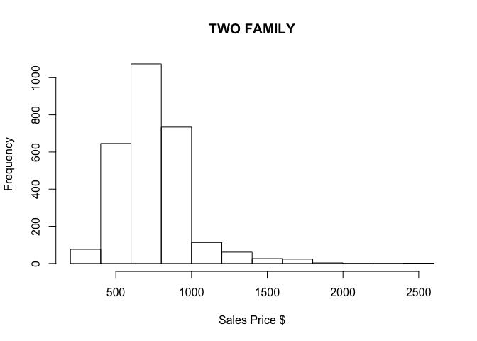

# Conclusion
Bill Kerneckel, Kyle Killion, Eyal Greenberg  
May 28, 2016  

## Conclusion and summary for 2011 Brooklyn real estate data


### Family Distributions BreakDown

```r
bk.homes$outliers <- (log10(bk.homes$sale.price.n) <=5) + 0
bk.homes <- bk.homes[which(bk.homes$outliers==0),]


thing <- c('ONE FAMILY','TWO FAMILY','THREE FAMILY')

for (i in thing){
  Fam <- bk.homes[which(grepl(i, bk.homes$building.class.category)),]
  print(i)
  print(paste('Avg Gross sqft : ', mean(Fam$gross.sqft)))
  print(paste("SD : ", sd(Fam$gross.sqft)))
  print(paste('Avg Sale Price : ', mean(Fam$sale.price.n)))
  print(paste("SD :", sd(Fam$sale.price.n)))
  plot(log(Fam$gross.sqft),log(Fam$sale.price.n),
     xlab = 'Gross sqft',
     ylab = 'Sales Price $',
     main = i)
  
  #Sqrt the Sales Prices instead of Log
  hist(sqrt(Fam$sale.price.n),
       main = i,
       xlab = 'Sales Price $')
  
  boxplot(log(Fam$sale.price.n), xlab = i,
          ylab = 'Sales Price')
  
  boxplot(log(Fam$gross.sqft), xlab = i,
          ylab = 'Gross sqft')
}
```

```
## [1] "ONE FAMILY"
## [1] "Avg Gross sqft :  1811.45422031474"
## [1] "SD :  910.882625354433"
## [1] "Avg Sale Price :  614347.640915594"
## [1] "SD : 585689.166630431"
```

<!-- --><!-- --><!-- -->

```
## Warning in bplt(at[i], wid = width[i], stats = z$stats[, i], out = z$out[z
## $group == : Outlier (-Inf) in boxplot 1 is not drawn
```

<!-- -->

```
## [1] "TWO FAMILY"
## [1] "Avg Gross sqft :  2446.85165034458"
## [1] "SD :  790.397374000062"
## [1] "Avg Sale Price :  606132.374682626"
## [1] "SD : 425984.955584185"
```

<!-- --><!-- --><!-- -->

```
## Warning in bplt(at[i], wid = width[i], stats = z$stats[, i], out = z$out[z
## $group == : Outlier (-Inf) in boxplot 1 is not drawn
```

<!-- -->

```
## [1] "THREE FAMILY"
## [1] "Avg Gross sqft :  3170.57158712542"
## [1] "SD :  1205.80662842239"
## [1] "Avg Sale Price :  641171.102108768"
## [1] "SD : 391469.142913755"
```

<!-- --><!-- --><!-- --><!-- -->

#### Conclusion

The sales price average for the Family of 3 carried the highest value at $641,171. The Family of two carried the lowest average sales price of $606,132. The Family of 1 carried the highest spread of data within sales price indicating that they have more income at disposal. 
